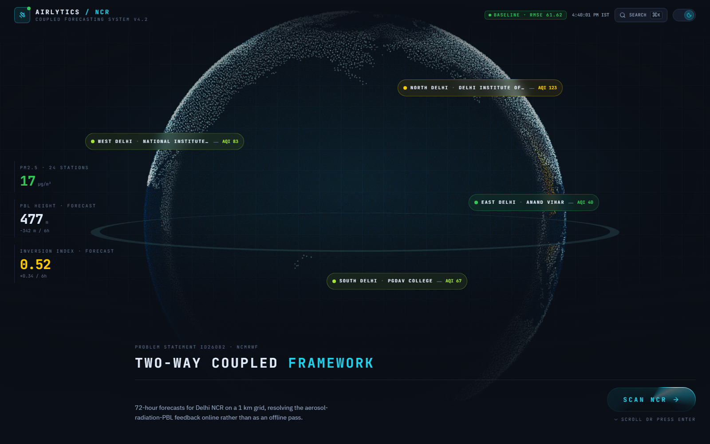
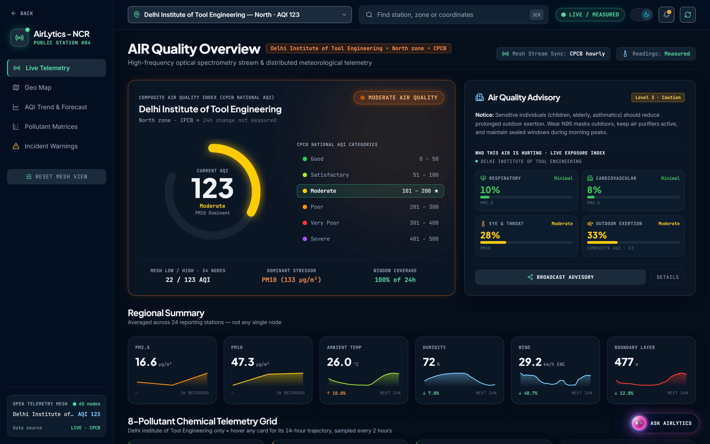
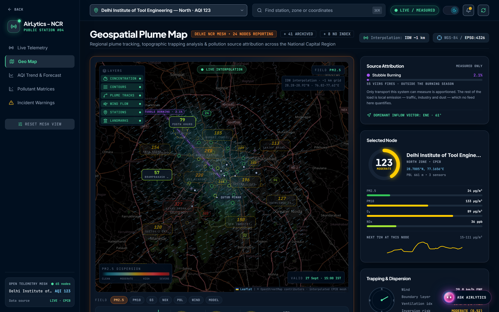
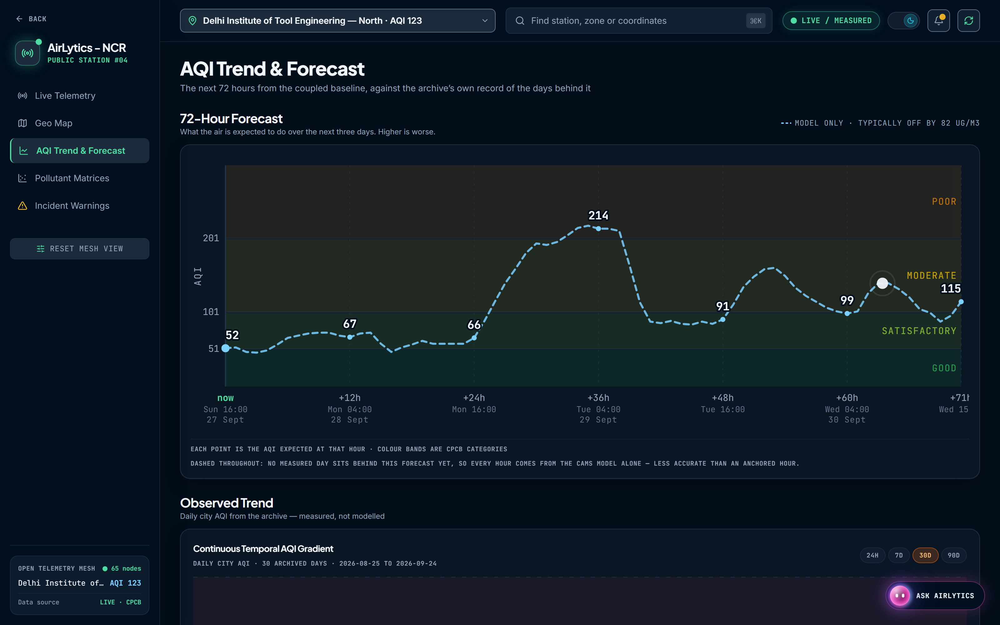

# AirLytics NCR

**A 72-hour air quality forecast for Delhi NCR that can show you where every number came from.**

Built for Smart India Hackathon 2026, problem statement **SIH26082** (Ministry of Earth Sciences / NCMRWF).

**[air-pollution-sense.vercel.app](https://air-pollution-sense.vercel.app/)** · API: [`/api/v1/status`](https://air-pollution-sense.vercel.app/api/v1/status)



---

## The problem with air quality dashboards

Most of them will tell you Delhi's AQI is 312. Almost none will tell you which station measured it, at what hour, from how many valid readings, or what the number would have been if the sensor it depends on had been offline.

That gap matters. CPCB's National AQI is not a measurement, it is an arithmetic result with rules: a 24-hour rolling average per pollutant, at least 16 valid hours in that window, at least three pollutants with one of them particulate, and the index is the **worst** sub-index rather than the average. A dashboard that silently fills gaps or averages across stations produces a number that looks authoritative and is not.

AirLytics is built the other way around. Every figure is traceable to a station and an hour, every gap is stated rather than filled, and where the system cannot know something it says so.

## What it does

| | |
|---|---|
| **Live station mesh** | 68 CPCB stations across Delhi NCR, each indexed independently under the CPCB National AQI (2014), 59 of them eligible under its rules. The live feed covers whichever are reporting this hour; the rest come from the archive, and each station says which it is. No interpolation between neighbours. |
| **72-hour forecast** | Validated blend baseline at **61.62 µg/m³ RMSE**, 27% better than raw CAMS, scored over 3,993,801 comparisons across a full annual cycle. |
| **Stubble fire corridor** | NASA VIIRS fire pixels clustered upwind, with transport alignment against the forecast wind field and an earliest-arrival estimate. |
| **GRAP policy engine** | Which stage the readings imply, and which restrictions follow from it. |
| **Inversion alerts** | Night-time boundary layer collapse, which is why the air gets worse after dark. |
| **Grounded AI assistant** | Answers questions about the air, but only from this system's own endpoints. Every answer prints the tool calls behind it. |



*Live telemetry. The index names the pollutant that set it, the window coverage it was computed over, and the mesh low and high beside it, so a single number is never the whole claim.*



*The plume map. Source attribution reports only what it can measure: 2.1% from stubble transport, with the rest named as local emission that no feed here quantifies, rather than split into invented percentages.*



*The 72-hour track. The line is dashed for every hour with no measured day behind it, and the caption says why: those hours come from the CAMS model alone and are less accurate than an anchored hour.*

## What makes it different

**The index refuses to lie.** A station that cannot meet CPCB's rules reports `valid: false` and the reasons why, not a number. Carbon monoxide is excluded entirely, because the catalogue labels it `ppb` while the values are magnitudes that can only be mg/m³ or ppm. Read as ppb, CO's sub-index collapses to roughly zero and would silently contribute nothing. mg/m³ and ppm differ by 15% and the label cannot be trusted to choose between them, so CO is withheld rather than guessed at.

**The forecast refuses to run ahead of its data.** The origin is capped at the last *observed* hour. Bounding it by the forecast index instead let a run start ahead of the newest measurement, and since gaps are forward-filled it still produced output, seeded by a "current" state that was in places nineteen hours stale and silently repeated.

**The assistant cannot invent a figure.** It has eight read-only tools over this system's own API and a prompt that forbids stating any number a tool did not return. Ask it what share of Delhi's PM2.5 comes from vehicles and it declines, because there is no emissions inventory behind it. Every answer carries receipts: which endpoint, which hour, how long it took.

One real turn, streamed from `POST /api/v1/assistant`:

```
> Is it safe to run outside right now?

  tool  city_now     74ms  ok  /api/v1/stations     as_of 2026-09-27T16:00 IST
  tool  grap_stage   26ms  ok  /api/v1/policy/grap  as_of 2026-09-27T10:47Z

  "the city mean AQI is 105 (Moderate), and there are no active GRAP
   restrictions. However, conditions range from a very clean AQI of 22 (Good)
   at Major Dhyan Chand National Stadium to a heavily polluted 327 (Very Poor)
   at Vikas Sadan, Gurugram. [...] If you have any pre-existing health
   conditions, please consult your doctor before exercising outdoors."
```

Two tools for one question, the spread rather than a city average that would hide a 300-point difference across 30 km, and a referral to a clinician instead of an invented safety threshold.

**The accuracy claim is re-measured, not remembered.** `19_refresh_archive.py` re-scores the baselines whenever the archive moves and rewrites the published RMSE in source. A figure measured on a window the product no longer serves is a stale claim, and the script exists so that it cannot quietly become one.

## Validated accuracy

Scored by `ml_pipeline/scripts/14_baselines.py` over December 2025 to September 2026, all leads +1 to +72h:

| Method | RMSE µg/m³ | MAE | Bias |
|---|---|---|---|
| **blend (diurnal + bias-corrected CAMS)** | **61.62** | 36.84 | +3.24 |
| diurnal persistence | 66.54 | 33.54 | +0.19 |
| climatology | 80.94 | 50.79 | −8.56 |
| persistence | 81.84 | 40.80 | −1.99 |
| bias-corrected CAMS | 82.49 | 54.34 | +6.81 |
| raw CAMS | 84.67 | 56.28 | +13.12 |

Error is flat across lead time (60.9 to 62.6 µg/m³ from +1h to +72h), which is the point of blending a diurnal parent with a corrected model field rather than trusting either alone.

## Quick start

Requires Python 3.10+ (running on 3.10.21 in production and 3.14.4 in development) and Node 20+ (Vite 8, React 19).

**Backend**

```bash
cd backend && pip install -r requirements.txt && python api_server.py
```

Serves on `http://localhost:8000`. The first request is slow, because it loads and parses the archive; later ones are cached.

**Frontend**

```bash
cd sih-dashboard && npm install && npm run dev
```

Serves on `http://localhost:5173`.

The dashboard runs with no API keys at all, replaying the bundled archive. Keys add live data on top of it.

## Configuration

All optional. Without them the system serves the archive rather than pretending to be live.

| Variable | Gets you | Where |
|---|---|---|
| `WAQI_TOKEN` or `AQICN_TOKEN` | Live station readings | [aqicn.org/data-platform/token](https://aqicn.org/data-platform/token) |
| `NASA_FIRMS_KEY` | Fire pixels for the corridor | [firms.modaps.eosdis.nasa.gov/api](https://firms.modaps.eosdis.nasa.gov/api/area) |
| `CPCB_API_KEY` | CPCB's own bulletin, preferred over WAQI | [data.gov.in](https://data.gov.in) |
| `GEMINI_API_KEY` | The assistant | [aistudio.google.com](https://aistudio.google.com) |
| `GEMINI_MODEL` | Override the model (default `gemini-3.8-flash`) | |
| `OPENAQ_API_KEY` | Refreshing the archive | [openaq.org](https://openaq.org) |

`CPCB_API_KEY` is worth the slower registration. WAQI republishes CPCB as US EPA sub-indices, so that path has to invert each index back to a concentration and drops NO2 and SO2 over a window mismatch. For the same hour, Wazirpur came out 163 "Moderate" through WAQI and 231 "Poor" from the bulletin, a whole band apart, on the pollutant setting the index.

## API

```
GET  /api/v1/stations              the mesh, one CPCB AQI per station
GET  /api/v1/forecast/grid         gridded 72-hour PM2.5
GET  /api/v1/forecast/frames       animation frames
GET  /api/v1/forecast/station/{id} one station's track
GET  /api/v1/fires                 fire clusters, corridor, transport
GET  /api/v1/policy/grap           stage and restrictions
GET  /api/v1/alerts/inversion      night-time inversion risk
GET  /api/v1/history/city          daily city PM2.5 and AQI
GET  /api/v1/met/gfs               NOAA GFS extract
GET  /api/v1/status                model, sources, provenance
POST /api/v1/assistant             one grounded turn, streamed as SSE
```

## Keeping the data current

The service replays a real window, so "how current is it" is a data question rather than a code one:

```bash
python ml_pipeline/scripts/19_refresh_archive.py
```

It fetches only the missing window, merges without losing anything held, re-scores the baselines, refits the CAMS correction, rewrites the published RMSE in source, regenerates the dashboard's offline snapshot, and retunes the synthetic fallback. Those last steps are the reason it is a script and not a note: each one is a frozen view of the old window, and forgetting any of them leaves the product claiming something about data it no longer serves.

About 36 to 48 hours of lag remains and cannot be closed from here. That is CPCB's own publication delay through OpenAQ. Live readings cover the present.

## Tests

```bash
cd backend && python test_aqi_cpcb.py        # 49 cases against CPCB's published rules
python test_observation_qc.py
python test_waqi_live.py
python test_firms_fire.py
```

`test_aqi_cpcb.py` is the one that matters: it checks sub-index breakpoints, the minimum-valid-hours rule, the 8-hour window for CO and ozone, unit conversion before indexing, and that an ineligible station reports its reasons instead of a number.

## Known limits

Stated here rather than left to be discovered:

- **The ConvLSTM is not driving the published forecast.** `weights_loaded: false`. The architecture is implemented and its feedback coupling is tested, but the served numbers come from the validated blend baseline. `/api/v1/status` says so at runtime.
- **The aerosol-PBL feedback is a diagnostic, not a correction.** The blend is built from observations that already happened under the real feedback, so feeding the modelled PBL response back into PM2.5 would count the same physics twice.
- **Per-station meteorology is synthetic.** PBL height, wind and NOx per station are derived, not measured.
- **The archive lags.** See above.

## Repository layout

```
air_pollution_sense
│
├── backend/                      FastAPI service: indexing, forecast, assistant
│   ├── api_server.py             the eleven endpoints
│   ├── station_registry.py       the mesh, per-station AQI under CPCB rules
│   ├── aqi_cpcb.py               the 2014 index itself: breakpoints and windows
│   ├── baseline_forecaster.py    the validated blend and its published score
│   ├── firms_fire.py             VIIRS fire pixels, cached per origin date
│   ├── fire_corridor.py          clustering, transport alignment, arrival times
│   ├── assistant.py              the grounded assistant and its guardrails
│   ├── assistant_tools.py        its eight read-only tools
│   └── test_*.py                 CPCB rules, observation QC, fire parsing
│
├── sih-dashboard/                React + Vite frontend
│   └── src/
│       ├── components/terminal/  the dashboard proper
│       ├── components/intro/     the entry sequence
│       └── lib/terminal/         API clients and index maths
│
├── ml_pipeline/
│   ├── scripts/                  fetch, build, train, score, refresh
│   │   ├── 14_baselines.py       scores every method, sets the published RMSE
│   │   ├── 16_train_coupled.py   ConvLSTM training harness
│   │   └── 19_refresh_archive.py one command to bring the archive current
│   └── data/                     the served archive
│
└── external_data_pipeline/       ingestion for satellite and sensor feeds
```

## Team

Built for SIH 2026, problem statement SIH26082, Ministry of Earth Sciences / NCMRWF.
