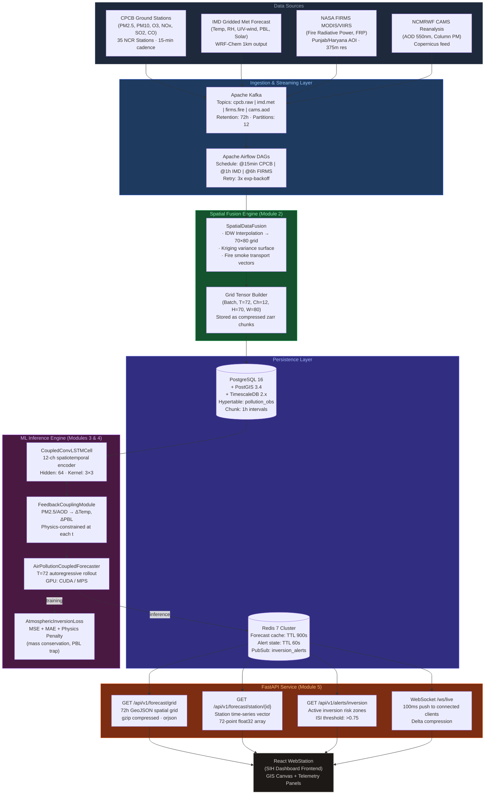
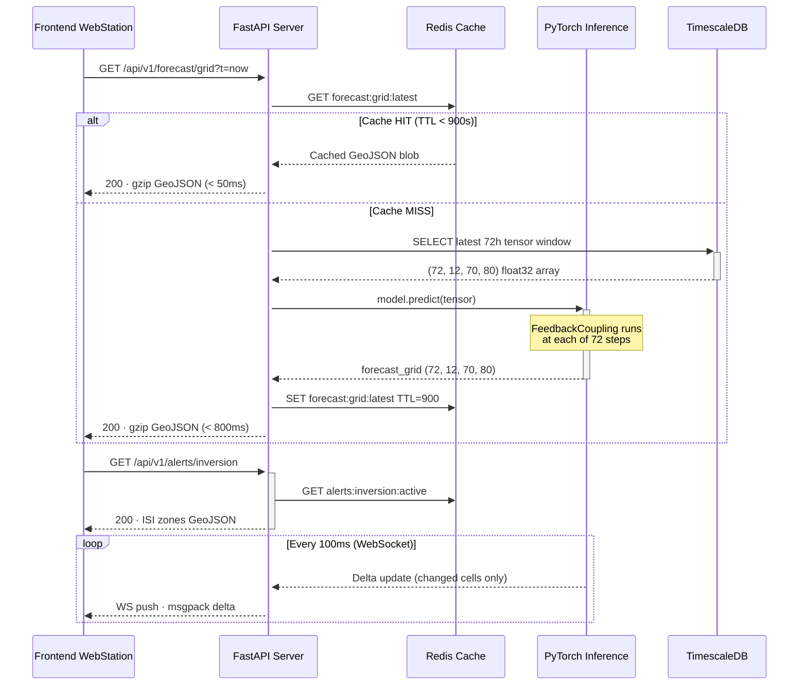

# SIH26082 — System Architecture (Module 1)

## Data Flow Architecture



---

## Real-Time Inference Sequence



---

## Database Schema (TimescaleDB)

```sql
-- Hypertable for 15-min station observations
CREATE TABLE pollution_obs (
    time        TIMESTAMPTZ NOT NULL,
    station_id  TEXT        NOT NULL,
    lat         FLOAT8      NOT NULL,
    lon         FLOAT8      NOT NULL,
    geom        GEOMETRY(Point, 4326),
    pm25        FLOAT4,
    pm10        FLOAT4,
    o3          FLOAT4,
    nox         FLOAT4,
    so2         FLOAT4,
    co          FLOAT4,
    temp        FLOAT4,
    rh          FLOAT4,
    u_wind      FLOAT4,
    v_wind      FLOAT4,
    solar_irr   FLOAT4,
    pbl_height  FLOAT4,
    aod_550nm   FLOAT4
);
SELECT create_hypertable('pollution_obs', 'time', chunk_time_interval => INTERVAL '1 hour');
CREATE INDEX ON pollution_obs (station_id, time DESC);
CREATE INDEX ON pollution_obs USING GIST (geom);

-- Forecast grid snapshots
CREATE TABLE forecast_grids (
    issued_at   TIMESTAMPTZ NOT NULL,
    valid_at    TIMESTAMPTZ NOT NULL,
    channel     TEXT        NOT NULL,  -- 'pm25'|'pbl'|'solar'|...
    grid_data   BYTEA       NOT NULL,  -- msgpack float32 70x80
    PRIMARY KEY (issued_at, valid_at, channel)
);
```
